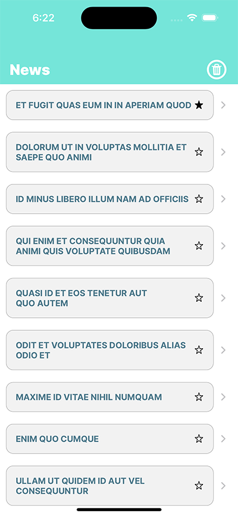
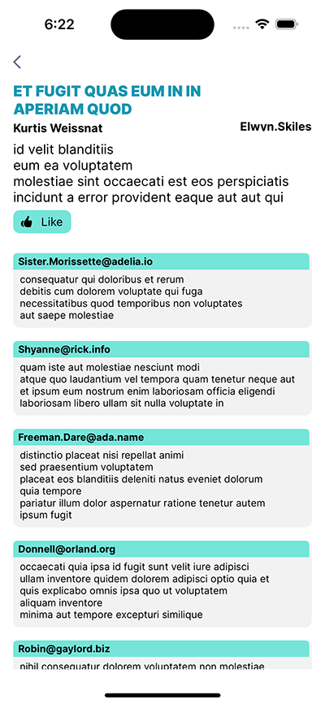

### Setup
This project was implemented using XCode 14 and iOS 16 deployment target.
- Download repo from:
https://github.com/jpazurduy/Zemoga.git
- The project uses cocoapods so we need to download dependencies:
- Open a terminal windows 
- Go to the project folder.
- Execute "pod install" command 
- Open the workspace.

# Summary
- The project is using Coordinatoor pattern for navigation and singleton to manage API calls.
- The Post view was made programatically and the Detail view using autolayout interface. 
- MVVM Architecture
- The projects is using 2 third party libs:
### MBProgressHUD
A good and easy pod to show  progress spinner, highly used in many projects, friendly for user and developer :)
### SwiftyBeaver
Cloud solution to review and track app behavior for devs.
Colorful, flexible, lightweight logging for Swift 3, Swift 4 & Swift 5. Logs are stored in cl

# App screens

 

# Notes
The CoreData support is only for the first screen(PostViewController), DetailViewController does not have implementation to persist data.

### End
